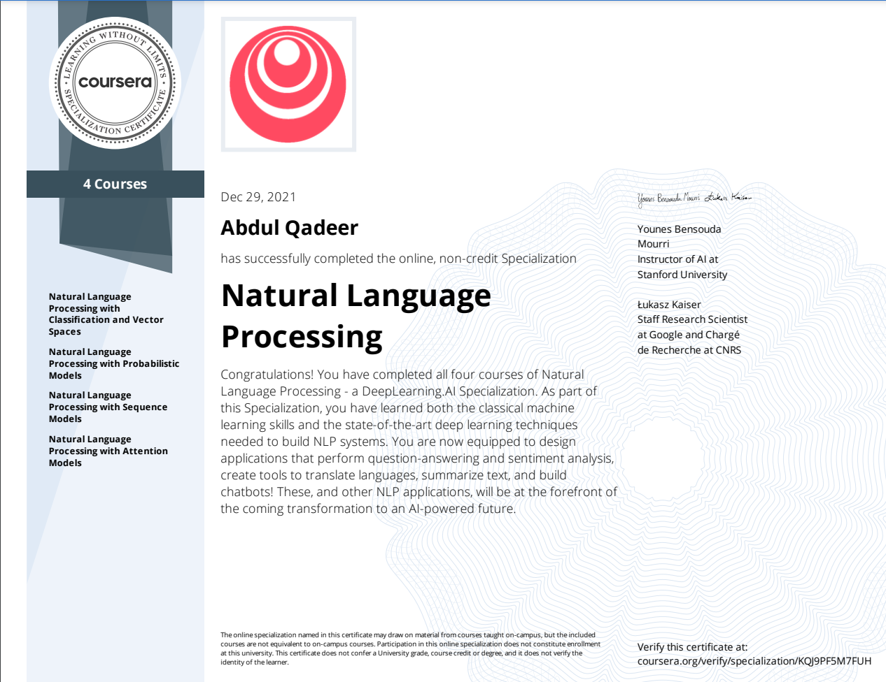

# Natural-Language-Processing

 
## Course 1: Classification and Vector Spaces in NLP

* [**Week 1: Logistic Regression for Sentiment Analysis of Tweets**](https://github.com/aqafridi/Natural-Language-Processing/tree/main/1.%20Natural%20Language%20Processing%20with%20Classification%20and%20Vector%20Spaces/Week%201%20Sentiment%20Analysis%20with%20Logistic%20Regression)

* [**Week 2: Naïve Bayes for Sentiment Analysis of Tweets**](https://github.com/aqafridi/Natural-Language-Processing/tree/main/1.%20Natural%20Language%20Processing%20with%20Classification%20and%20Vector%20Spaces/Week%202%20Sentiment%20Analysis%20with%20Na%C3%AFve%20Bayes)

* [**Week 3: Vector Space Models**](https://github.com/aqafridi/Natural-Language-Processing/tree/main/1.%20Natural%20Language%20Processing%20with%20Classification%20and%20Vector%20Spaces/Week%203%20Vector%20Space%20Models)

* [**Week 4: Word Embeddings and Locality Sensitive Hashing for Machine Translation**](https://github.com/aqafridi/Natural-Language-Processing/tree/main/1.%20Natural%20Language%20Processing%20with%20Classification%20and%20Vector%20Spaces/Week%204%20Machine%20Translation%20and%20Document%20Search)

* [**Slides**](https://github.com/aqafridi/Natural-Language-Processing/tree/main/1.%20Natural%20Language%20Processing%20with%20Classification%20and%20Vector%20Spaces/Slides)

## Course 2: Probabilistic Models in NLP

* [**Week 1: Auto-correct using Minimum Edit Distance**](https://github.com/aqafridi/Natural-Language-Processing/tree/main/2%20.Natural%20Language%20Processing%20with%20Probabilistic%20Models/Week%201%20Auto-correct%20using%20Minimum%20Edit%20Distance)

* [**Week 2: Part-of-Speech (POS) Tagging**](https://github.com/aqafridi/Natural-Language-Processing/tree/main/2%20.Natural%20Language%20Processing%20with%20Probabilistic%20Models/Week%202%20Part-of-Speech%20(POS)%20Tagging)

* [**Week 3: N-gram Language Models**](https://github.com/aqafridi/Natural-Language-Processing/tree/main/2%20.Natural%20Language%20Processing%20with%20Probabilistic%20Models/Week%203%20N-gram%20Language%20Models)

* [**Week 4: Word2Vec and Stochastic Gradient Descent**](https://github.com/aqafridi/Natural-Language-Processing/tree/main/2%20.Natural%20Language%20Processing%20with%20Probabilistic%20Models/Week%204%20Word2Vec%20and%20Stochastic%20Gradient%20Descent)

## Course 3: Sequence Models in NLP

* [**Week 1: Sentiment with Neural Nets**](https://github.com/aqafridi/Natural-Language-Processing/tree/main/3.%20Natural%20Language%20Processing%20with%20Sequence%20Models/Week%201%20Neural%20Networks%20for%20Sentiment%20Analysis)

* [**Week 2: RNN/GRU for Language Generation Models**](https://github.com/aqafridi/Natural-Language-Processing/tree/main/3.%20Natural%20Language%20Processing%20with%20Sequence%20Models/Week%202%20Recurrent%20Neural%20Networks%20for%20Language%20Modeling)

* [**Week 3: Named Entity Recognition (NER)**](https://github.com/aqafridi/Natural-Language-Processing/tree/main/3.%20Natural%20Language%20Processing%20with%20Sequence%20Models/Week%203%20LSTMs%20and%20Named%20Entity%20Recognition)

* [**Week 4: Siamese Networks**](https://github.com/aqafridi/Natural-Language-Processing/tree/main/3.%20Natural%20Language%20Processing%20with%20Sequence%20Models/Week%204%20Siamese%20Networks)

* [**Slides**](https://github.com/aqafridi/Natural-Language-Processing/tree/main/3.%20Natural%20Language%20Processing%20with%20Sequence%20Models/Slides)

## Course 4: Attention Models in NLP

* [**Week 1: Neural Machine Translation with Attention**](https://github.com/aqafridi/Natural-Language-Processing/tree/main/4.%20Natural%20Language%20Processing%20with%20Attention%20Models/Week%201%20Neural%20Machine%20Translation%20with%20Attention)

* [**Week 2: Summarization with Transformer Models**](https://github.com/aqafridi/Natural-Language-Processing/tree/main/4.%20Natural%20Language%20Processing%20with%20Attention%20Models/Week%202%20Summarization%20with%20Transformer%20Models)

* [**Week 3: Question-Answering with Transformer(BERT) Models**](https://github.com/aqafridi/Natural-Language-Processing/tree/main/4.%20Natural%20Language%20Processing%20with%20Attention%20Models/Week%203%20Question-Answering%20with%20Transformer(BERT)%20Models)

* [**Week 4: Chatbots with a Reformer Model**](https://github.com/aqafridi/Natural-Language-Processing/tree/main/4.%20Natural%20Language%20Processing%20with%20Attention%20Models/Week%204%20Chatbots%20with%20a%20Reformer%20Model)

